<div align="center">

[](https://git.io/typing-svg)


**Aplikasi Visualisasi Data Interaktif**

Dashboard analitik modern untuk visualisasi data umum, akademik, dan kemahasiswaan prodi secara real-time dengan arsitektur Cloud-Native.

[](https://laravel.com/)
[](https://vuejs.org/)
[](https://vitejs.dev/)

[](https://www.chartjs.org/)
[](https://leafletjs.com/)
 
</div>

<div align="center">

---

### 📈 Project Stats


</div>

---

## 📑 Table of Contents

- [📖 Tentang Proyek](#-tentang-proyek)
- [✨ Fitur Utama](#-fitur-utama)
- [🛠️ Tech Stack](#️-tech-stack)
- [👥 Tim Pengembang](#-tim-pengembang-kelompok-c33)
- [💻 Panduan Instalasi](#-panduan-instalasi)
- [🎯 Menjalankan Aplikasi](#-menjalankan-aplikasi)
- [🚨 Troubleshooting](#-troubleshooting)
- [📊 API Endpoints](#-api-endpoints-datacore)
- [⭐ Acknowledgments](#-acknowledgments)
- [📚 Resources & Documentation](#-resources--documentation)

---

## 📖 Tentang Proyek

**Polban DataView** adalah komponen visualisasi *front-end* dari ekosistem **Polban Dataverse**. Aplikasi ini bertugas menyajikan data dalam bentuk grafik interaktif dan peta sebaran untuk memudahkan pemahaman informasi mahasiswa dan akademik Politeknik Negeri Bandung.

### 🔗 Ekosistem Polban Dataverse

Proyek ini merupakan bagian dari kolaborasi tiga tim pengembang:

1. **[DataHub](https://github.com/ErsyaHasby/polban-datahub)** - Mengelola *database*, struktur tabel, halaman admin, dan data partisipan
2. **[DataCore](https://github.com/muhamadSyahid/polban-datacore)** - Mengagregasi data dari DataHub dan menyediakannya melalui REST API ([Lihat Dokumentasi API](#-api-endpoints-datacore))
3. **[DataView](https://github.com/ihsan-ramadhan/polban-dataview)** (Repositori ini) - Mengambil data dari API DataCore dan memvisualisasikannya kepada pengguna

### 🔄 Alur Data

```mermaid
flowchart LR
    subgraph DataSource [💾 Data Layer]
        direction TB
        A[("🗄️ DataHub")]
    end

    subgraph Backend [⚙️ API Layer]
        B["🔌 DataCore"]
    end

    subgraph Frontend [💻 Client Layer]
        C["🖥️ DataView"]
    end

    subgraph User [👤 End User]
        D["👀 Guest / Internal"]
    end

    %% Flow
    A ==>|Raw Data Query| B
    B ==>|JSON REST API| C
    C ==>|Interactive UI| D
    D -.->|Filter & Interaction| C
    
    %% Styling
    style A fill:#e1f5fe,stroke:#01579b,stroke-width:2px,color:#000
    style B fill:#fff3e0,stroke:#ff6f00,stroke-width:2px,color:#000
    style C fill:#f3e5f5,stroke:#7b1fa2,stroke-width:2px,color:#000
    style D fill:#e8f5e9,stroke:#2e7d32,stroke-width:2px,color:#000
```



---

## ✨ Fitur Utama

### 📊 Visualisasi Interaktif
- **Grafik Dinamis**: Pie Chart dan Bar Chart menggunakan Chart.js
- **Peta Sebaran**: Visualisasi domisili mahasiswa dengan Leaflet.js
- **Integrasi API**: Mengonsumsi data teragregasi yang disediakan oleh tim DataCore.

### 🔐 Sistem Akses Bertingkat

| Mode | Akses | Fitur |
|------|-------|-------|
| **Guest** | Publik | Data statistik umum |
| **Internal** | Login Required | Akses penuh data Akademik & Kemahasiswaan |

### ⚡ Teknologi Modern
- **Single Page Application (SPA)**: Pengalaman pengguna mulus tanpa reload halaman
- **Cloud Architecture**: Frontend terpisah yang terhubung ke Backend API
- **Responsive Design**: Optimal di desktop dan mobile

---

## 🛠️ Tech Stack

### Frontend
- **Framework**: [Vue.js](https://vuejs.org/)
- **Build Tool**: [Vite](https://vitejs.dev/)
- **UI Components**: 
  - [Chart.js](https://www.chartjs.org/) & [Vue-chartjs](https://vue-chartjs.org/) - Visualisasi data
  - [Leaflet.js](https://leafletjs.com/) - Peta interaktif
- **Styling**: Custom CSS dengan CSS Variables

### Backend
- **Framework**: [Laravel](https://laravel.com/)

## 👥 Tim Pengembang (Kelompok C3.3)

<div align="center">

<table>
  <tr>
    <td align="center">
      <a href="https://github.com/ihsan-ramadhan">
        <br />
        <sub><b>Muhammad Ihsan Ramadhan</b></sub>
      </a><br />
      <sub>Ketua - UI Lead</sub>
      <sub><br>241511083</br></sub>
    </td>
    <td align="center">
      <a href="https://github.com/MuhammadBrataH">
        <br />
        <sub><b>Muhammad Brata Hadinata</b></sub>
      </a><br />
      <sub>Backend - Authentication</sub>
      <sub><br>241511082</br></sub>
    </td>
    <td align="center">
      <a href="https://github.com/VarianAbi">
        <br />
        <sub><b>Varian Abidarma Syuhada</b></sub>
      </a><br />
      <sub>Frontend - Home</sub>
      <sub><br>241511091</br></sub>
    </td>
  </tr>
  <tr>
    <td align="center">
      <a href="https://github.com/Hanif13579">
        <br />
        <sub><b>Hanifidin Ibrahim</b></sub>
      </a><br />
      <sub>Frontend - Akademik</sub>
      <sub><br>241511076</br></sub>
    </td>
    <td align="center">
      <a href="https://github.com/ftmhhwwa">
        <br />
        <sub><b>Fatimah Hawwa Alkhansa</b></sub>
      </a><br />
      <sub>Frontend - Kemahasiswaan</sub>
      <sub><br>241511074</br></sub>
    </td>
    <td align="center">
      <a href="https://github.com/ihsan-ramadhan/polban-dataview/graphs/contributors">
        <br />
        <sub><b>All Contributors</b></sub>
      </a><br />
      <sub>View All</sub>
    </td>
  </tr>
</table>

</div>

---

## 💻 Panduan Instalasi

### 📋 Prasyarat


| Software | Minimum Version | Link Download |
|----------|----------------|---------------|
| PHP | 8.1+ | [php.net](https://www.php.net/downloads) |
| Composer | 2.x | [getcomposer.org](https://getcomposer.org/) |
| Node.js | 18.x+ | [nodejs.org](https://nodejs.org/) |
| NPM | 9.x+ | (included with Node.js) |
| Git | 2.x | [git-scm.com](https://git-scm.com/) |

> **💡 Tips Windows**: Gunakan [Laragon](https://laragon.org/) atau [XAMPP](https://www.apachefriends.org/) untuk kemudahan setup PHP & Composer.

### 🚀 Langkah Instalasi

#### 1️⃣ Clone Repository

```bash
# Clone repository
git clone https://github.com/ihsan-ramadhan/polban-dataview

# Masuk ke direktori project
cd polban-dataview

# Masuk ke direktori Laravel + Vue
cd laravel-vue
```

#### 2️⃣ Install Dependencies

```bash
# Install PHP dependencies (Laravel & packages)
composer install

# Install JavaScript dependencies (Vue, Chart.js, Leaflet)
npm install
```

#### 3️⃣ Setup Environment

```bash
# Copy file environment
cp .env.example .env

# Generate application key (wajib untuk keamanan)
php artisan key:generate

# Jalankan migrasi database
php artisan migrate
```

## 🎯 Menjalankan Aplikasi

### Metode 1: Development Mode (Recommended)

Karena menggunakan **Vite**, Anda perlu menjalankan **2 terminal** secara bersamaan:

#### Terminal 1 - Laravel Server
```bash
php artisan serve
```

#### Terminal 2 - Vite Development Server
```bash
npm run dev
```

### Metode 2: Production Build

Untuk production atau testing build:

```bash
# Build assets untuk production
npm run build

# Jalankan Laravel server
php artisan serve
```

---

## 🚨 Troubleshooting

### ❌ Error "Failed to download" saat Composer Install

**Penyebab**: PHP zip extension tidak aktif

**Error yang muncul**:
```
Failed to download doctrine/inflector from dist: The zip extension and unzip/7z commands are both missing, skipping.
The php.ini used by your command-line PHP is: C:\xampp\php\php.ini
```

**Solusi**:

1. **Buka file `php.ini`**:
   - Lokasi: `C:\xampp\php\php.ini` (XAMPP)
   - Atau: `C:\laragon\bin\php\php8.x\php.ini` (Laragon)

2. **Cari baris berikut** (gunakan Ctrl+F):
   ```ini
   ;extension=zip
   ```

3. **Hapus tanda titik koma** (`;`) di depannya:
   ```ini
   extension=zip
   ```

4. **Restart terminal/command prompt** dan jalankan ulang:
   ```bash
   composer install
   ```

---


## 📊 API Endpoints (DataCore)

Aplikasi ini menggunakan REST API yang disediakan oleh layanan **DataCore**. Untuk melihat daftar lengkap endpoint, struktur request, dan contoh response, silakan kunjungi dokumentasi ini:

**URL Dokumentasi:** 🔗 [https://ikhsan3adi.is-a.dev/polban-datacore-api-docs/](https://ikhsan3adi.is-a.dev/polban-datacore-api-docs/)

---


## ⭐ Acknowledgments

Terima kasih kepada:

- **Politeknik Negeri Bandung** - Institusi pendidikan
- **Dosen Pembimbing** - Bimbingan dan arahan proyek
- **Tim DataHub & DataCore** - Kolaborasi backend yang solid
- **Open Source Community** - Libraries dan tools yang digunakan

---

## 📚 Resources & Documentation

### Official Docs
- [Laravel Documentation](https://laravel.com/docs)
- [Vue.js Guide](https://vuejs.org/guide/)
- [Vite Documentation](https://vitejs.dev/guide/)
- [Chart.js Documentation](https://www.chartjs.org/docs/)
- [Leaflet Documentation](https://leafletjs.com/reference.html)

### Related Repositories
- [DataHub Repository](https://github.com/ErsyaHasby/polban-datahub)
- [DataCore Repository](https://github.com/muhamadSyahid/polban-datacore)

### Tutorials & References
- [Laravel + Vue.js Setup Guide](https://laravel.com/docs/vite#vue)
- [Chart.js with Vue 3](https://vue-chartjs.org/guide/)
- [Leaflet Quick Start](https://leafletjs.com/examples/quick-start/)

---

<div align="center">

**Dibuat dengan ❤️ dan ☕ oleh Tim Polban DataView**

[](https://github.com/ihsan-ramadhan/polban-dataview)
[](https://github.com/ihsan-ramadhan/polban-dataview/fork)
[](https://github.com/ihsan-ramadhan/polban-dataview/issues)


</div>
